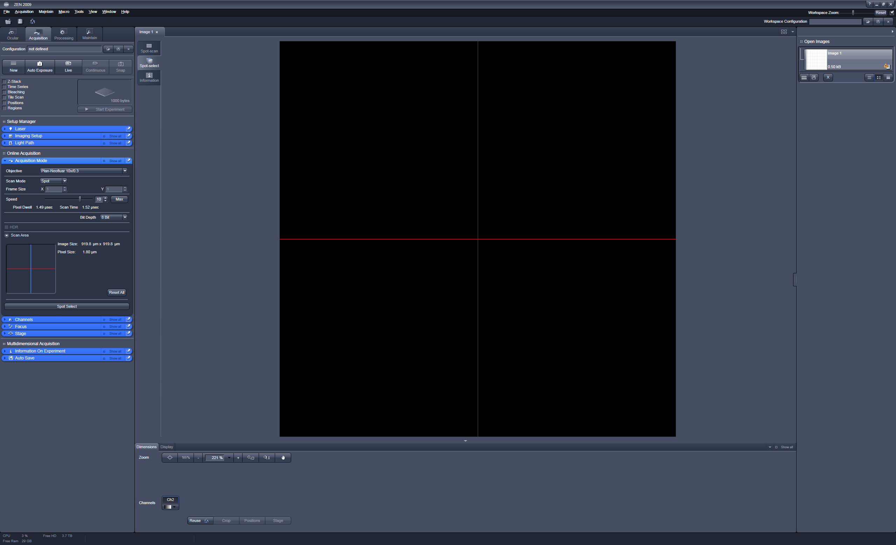

# Brillouin Acquisition

This is the software required for acquiring Brillouin spectra with the Brillouin microscope in Biotec Room 340.

## Image Acquisition

ZEN 2009 is used to control the scanning mirrors and to set the focus of the microscope. A MATLAB program is used to control ZEN and the Andor Zyla camera.

1. Start the LSM510 and the microscope *before* the PC. Otherwise the PC won't recognize the Electronic control unit (ECU) of the microscope and cannot control it.
2. Start the PC. You can conrol wether the ECU was found or not in the Windows Device Manager. It should be shown as "Carl Zeiss LSM 510 ECU on SCSI bus" under "Imaging devices".
3. Start ZEN 2009 and click "Start system". The LSM510 will be initialized.
4. In order to prepare ZEN for the image acquisition via MATLAB go to "Acquisition" and select the tab "Acquisition Mode". Set the Scan Mode to "Spot" and click on "Spot select". ZEN is ready now and shold look like this: .
5. Start MATLAB and run the program "BrillouinAcquisition\main.m". Set all parameters and start the script.

## Error messages

- Sometimes during the initialization of the ECU ZEN shows the message "System configuration problem." In this case restart ZEN and initialize the ECU again. It should succeed now.