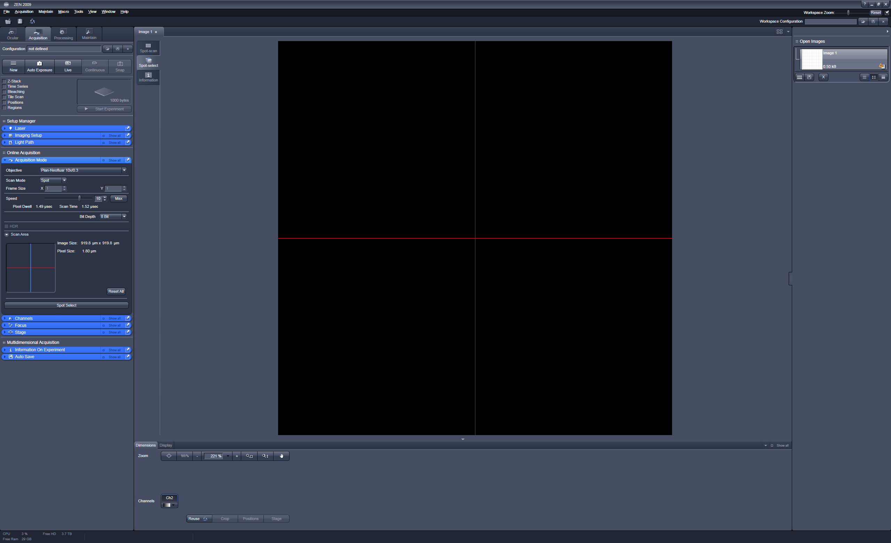
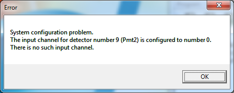

# Brillouin Acquisition

This is the software required for acquiring Brillouin spectra with the Brillouin microscope in Biotec Room 340.

## Alignment of the microscope

### Requirements

- Optimal coupling efficiency for the input as well as the output path.
- Acquiring a Brillouin signal from a fluid must be possible without the absorption cell.

### Procedure

Alignment and measurements are performed using the following configuration of the LSM510: HT=5; NT1=5; NT3=4. Before starting the alignment, make sure all beamsplitters and Pinhole 4 are positioned correctly.

#### General alignment
1. Couple the Laser to the input channel and maximize the light power at the measurement volume. Check with a powermeter.
2. Mount the IDS camera chip on the microscope and move the focus to the surface of the camera chip by moving the objective. Make sure, that collimator 1 is located in it's central position. Check that the focus is symmetrical, adjust by positioning the input fibre.
3. Align the output and input channel by coupling light into the output fibre. Check the position on the camera chip. Take care to not move the camera and align the focus of the output channel by moving the fibre position.
4. Replace the camera chip with a mirror and connect the output fibre to the powermeter. Couple light into the input fibre and adjust the output fibre position in order to maximize the light power.
5. Connect the fibre to the spectrometer and check the correct alignment by measuring a test sample e.g. Methanol. Fine-tune the alignment of the output fibre if necessary.

#### Special alignment before a measurement
During the start of ZEN2009 the program resets all devices in the LSM to their initial positions. Thus, the correct alignment is affected. Move the beamsplitters and Pinhole 4 to their correct position and realign the observation path if necessary.

## Image Acquisition

ZEN 2009 is used to control the scanning mirrors and to set the focus of the microscope. A MATLAB program is used to control ZEN and the Andor Zyla camera.

1. Start the LSM510 and the microscope *before* the PC. Otherwise the PC won't recognize the Electronic control unit (ECU) of the microscope and cannot control it.
2. Start the PC. You can control wether the ECU was found or not in the Windows Device Manager. It should be shown as "Carl Zeiss LSM 510 ECU on SCSI bus" under "Imaging devices".
3. Start ZEN 2009 and click "Start system". The LSM510 will be initialized.
4. In order to prepare ZEN for the image acquisition via MATLAB go to "Acquisition" and select the tab "Acquisition Mode". Set the Scan Mode to "Spot" and click on "Spot select". ZEN is ready now and shold look like this: .
5. Start MATLAB and run the program "BrillouinAcquisition\main.m". Set all parameters and start the script.

## Known issues

- The first try to initilize the ECU by ZEN always fails for an unknown reason with the shown error message.  The second initialization will succeed and ZEN is able ton control the LSM. The third start/initialization always leads to a BlueSreen of the PC.